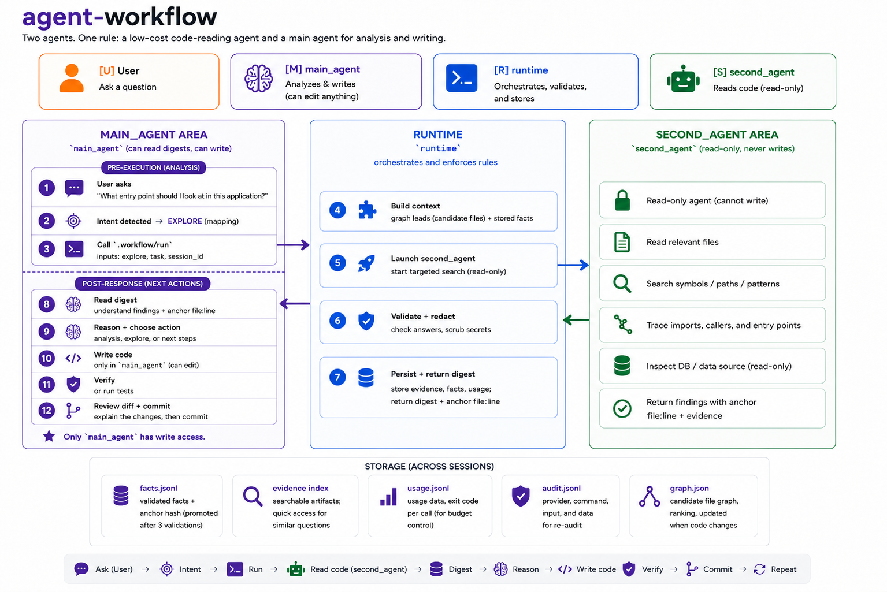

<div align="center">

# agent-workflow

**Stop burning premium context on reading code.**

A two-agent orchestration runtime that delegates codebase reading and search to a
cheaper agent, so Claude Code spends its context window on reasoning instead of raw
file contents.

[](LICENSE)
[](https://www.python.org/downloads/)
[](#requirements)
[](CHANGELOG.md)

<br>



</div>

---

## Table of Contents

- [Overview](#overview)
- [Why use it](#why-use-it)
- [Who it is for](#who-it-is-for)
- [What it is effective for](#what-it-is-effective-for)
- [Requirements](#requirements)
- [Installation](#installation)
- [Usage](#usage)
- [Commands](#commands)
- [Continuous integration](#continuous-integration)
- [Security considerations](#security-considerations)
- [Documentation](#documentation)
- [License](#license)

---

## Overview

`agent-workflow` sits between two AI agents and enforces a strict division of labour
between them.

| Role | Who | Responsibility |
| --- | --- | --- |
| **main_agent** | Claude Code, Codex, Cursor | Reasoning, decisions, and the **only** party allowed to write files |
| **second_agent** | OpenCode, Codex, or Agy — a cheaper model | Reading and searching the codebase, strictly **read-only** |

The premise is that most of what a coding agent does is not reasoning. It is reading
files, grepping, and tracing call sites — mechanical work that does not require a
frontier model. That work is what gets delegated.

### How it works

```text
You ask Claude Code a question
        │
        ▼
Claude Code invokes a single script:
  .workflow/run.ps1 explore "find the auth entry point" "<SESSION_ID>"
        │
        ▼
The runtime builds a structured prompt and launches the cheaper agent
        │
        ▼
The cheaper agent reads 40 files, traces imports, and collects evidence
        │
        ▼
The runtime validates the response shape and persists the evidence to disk
        │
        ▼
Claude Code receives a DIGEST plus file:line anchors — not the 40 files
        │
        ▼
Claude Code reasons and writes the code
```

Every delegated call returns the same envelope, so the calling agent never has to guess:

```json
{ "ok": true, "content": "...", "meta": {}, "digest": {} }
```

The runtime ships with **zero third-party dependencies** and runs entirely on the Python
standard library.

---

## Why use it

### 1. Lower cost

Reading code is high-volume, low-value work. Tracing a single module can mean opening
dozens of files, and every one of them enters a premium model as input tokens.

Delegated to a cheaper agent, the same work costs a fraction — and several supported
providers offer free model tiers. The premium model keeps the work that actually
requires it: causal analysis, design decisions, and writing code.

### 2. Preserved context — often the bigger win

A coding agent's context window is finite, and quality degrades as it fills:

- details from earlier in the conversation start getting missed;
- initial instructions get crowded out by accumulated file contents;
- the session ends sooner, forcing you to start over and re-explain.

Reading forty files directly can consume tens of thousands of tokens, and **those file
contents stay in the window for the rest of the session** even when only three lines
mattered.

With this runtime, only the digest and its `file:line` anchors enter the window. The full
evidence is persisted to `.workflow/` on disk and opened only when it is actually needed.

> **Result:** a single session lasts substantially longer, and its quality does not
> degrade partway through.

### 3. Auditable answers

Every claim returned by the delegated agent must carry a `file:line` anchor. The runtime
validates the response shape; a reply that stops before the contract is complete is asked
once for the missing block, then marked as failed. There is no unbounded retry loop.

Evidence is stored as an immutable artifact, so an equivalent question in a later session
can be served from disk without invoking the provider again.

---

## Who it is for

This project is a good fit if you:

- **use Claude Code as your primary coding agent** on a daily basis;
- **work in a large codebase** — hundreds to thousands of files, where "find every caller
  of this function" means sweeping many directories;
- **regularly exhaust your context window** mid-session and have to re-establish state;
- want lower cost per session without lowering the quality of decisions.

It is a poor fit if:

- your codebase is small (under roughly 50 files) — the agent can hold it directly, and
  this layer only adds indirection;
- you are unwilling to install a second agent CLI on your machine;
- you need instant answers — each delegated call takes tens of seconds to a few minutes,
  because the delegated agent genuinely reads the code.

---

## What it is effective for

The benefit scales with the **breadth** of the task — many files, many touch points.

| Task | Example question | Command |
| --- | --- | --- |
| **Mapping unfamiliar code** | "Where is the authentication logic?" "How does a request flow from route to database?" | `explore` |
| **Root-cause analysis** | "Why is this endpoint slow?" "Is it safe to drop this column?" | `analyze` |
| **Change planning** | "I want to add feature X — what are the steps?" | `plan` |
| **Blast radius** | "What does the current working tree touch?" | `sweep` |
| **Proving results** | "Is the change that was just made correct?" | `verify` |

It is less useful for a single-file change whose location you already know. If you know
the file and the line, ask your agent to edit it directly rather than routing through
this layer.

> **Writing code is never delegated.** The second agent only reads. All file
> modifications remain with the main agent, under your review. This is a deliberate
> design constraint, not a limitation.

---

## Requirements

| Requirement | Required | Notes |
| --- | --- | --- |
| **Python 3.10+** | Yes | No dependencies to install — the interpreter is sufficient |
| **A second-agent CLI** | Yes | One of `opencode` (recommended), `codex`, or `agy`, available on `PATH` |
| **git** | Recommended | Used by `sweep`, `syntax` verify mode, and the workspace guard |
| **Claude Code** | Recommended | The intended main agent; others work as well |

Verify before continuing:

```bash
python --version      # must be 3.10 or newer
opencode --version    # or: codex --version / agy --version
git --version
```

> **Choose `opencode` if you are unsure.** Of the three providers, only OpenCode has
> mechanically enforced permissions: the delegated agent is denied write and edit tools,
> denied reads of `.env` and key material, and restricted to read-only git commands. On
> `codex` and `agy` those boundaries are not machine-enforced. See
> [Security considerations](#security-considerations).

---

## Installation

Four steps. Steps 1–3 run once per machine; step 4 runs once per project.

### Step 1 — Clone the tool

```bash
git clone https://github.com/dammar01/agent-workflow.git
cd agent-workflow
```

Keep this directory somewhere permanent. The runtime records its absolute path; moving it
later requires re-running `upgrade`.

### Step 2 — Install the global agent configuration

Preview every change without writing anything:

```bash
python install.py
```

Apply once you are satisfied:

```bash
python install.py --apply
```

This installs the Claude Code configuration (skills and hooks) and the **permission block
for the delegated agent** — the write/edit denials and the shell command allowlist. This
step is what activates the security boundary; skipping it leaves the delegated agent
running without write restrictions.

### Step 3 — Register the location of `main.py`

The runtime needs to know where the tool lives for the first initialisation.

**Windows (persistent, run once):**

```powershell
[Environment]::SetEnvironmentVariable("AGENT_PATH", "C:/path/to/agent-workflow/main.py", "User")
```

Close and reopen the terminal for the variable to take effect.

**macOS / Linux (persistent):**

```bash
echo 'export AGENT_PATH="$HOME/path/to/agent-workflow/main.py"' >> ~/.bashrc   # or ~/.zshrc
source ~/.bashrc
```

Verify:

```bash
python "$AGENT_PATH" --help
```

```powershell
python $env:AGENT_PATH --help
```

### Step 4 — Enable it in your project

Run once for each project you want to use it in:

```bash
python "$AGENT_PATH" --command init --work-dir /path/to/your-project --pretty
```

```powershell
python $env:AGENT_PATH --command init --work-dir "C:/path/to/your-project" --pretty
```

This creates, inside your project:

| Path | Purpose |
| --- | --- |
| `.workflow/config.json` | Settings, plus absolute paths back to the tool |
| `.workflow/second_agent.json` | Provider and model selection; safe to edit |
| `.workflow/run.*`, `inspect.*`, `check.*` | Entry-point scripts (`.ps1` on Windows, `.sh` on POSIX) |
| `opencode.json` | Deny-list of secret files the delegated agent may not read |

`.workflow/` is added to the project's `.gitignore` automatically.

> **Do not commit `.workflow/`.** The generated scripts bake in absolute paths from the
> machine where `init` ran. Each team member runs step 4 themselves.

### Verifying the installation

```bash
python install.py --check
```

```bash
cd /path/to/your-project
.workflow/run.sh doctor          # Windows: .workflow\run.ps1 doctor
```

`doctor` must report **`READY`** with zero issues. A `NOT_READY` status means an entry
point is genuinely broken rather than merely untidy — read `recommended_fixes` before
proceeding.

---

## Usage

In normal use, the main agent invokes the runtime for you from natural language:

```text
you:  where is the authentication logic in this project?

Claude Code:  [INTENT] explore — location question
              (runs .workflow/run.ps1 explore "...")
```

To invoke it directly:

```bash
.workflow/run.sh explore "find the authentication entry point" "<SESSION_ID>"
```

```powershell
& ".workflow\run.ps1" explore "find the authentication entry point" "<SESSION_ID>"
```

The third argument is the session id and is **required**. Without it, concurrent sessions
fall back to a shared identifier and can overwrite each other's state.

### Troubleshooting

| Symptom | Likely cause | Action |
| --- | --- | --- |
| `doctor` reports `NOT_READY` | Scripts or config have drifted | `.workflow/run.sh upgrade` |
| `run_script_drift` | Tool was updated, scripts were not | Run `upgrade` from that machine |
| Provider not found | The agent CLI is not on `PATH` | Install it, then re-check `--version` |
| Commands fail after moving the repository | Baked absolute paths are stale | Run `upgrade` from the new location |

---

## Commands

| Command | Type | Purpose |
| --- | --- | --- |
| `init` | local | Enable the runtime in a project |
| `upgrade` | local | Refresh a workspace after the tool is updated |
| `doctor` | local | Readiness check; writes a report |
| `sweep` | local | Scan the working tree for changes |
| `clean` | local | Prune jobs, stale facts, and old sessions |
| `explore` | delegated | Code map, entry points, ownership |
| `analyze` | delegated | Causal analysis; no code changes |
| `plan` | delegated | Evidence-backed implementation steps |
| `verify` | delegated | Prove that completed work is correct |
| `promote-*` | local | Turn verified evidence into a Git-tracked knowledge document |

`promote-validate`, `promote-verify`, and `promote-write` are three stages of one flow, kept
apart because the user's approval happens between them — the CLI cannot ask anything, so
verification stops at a verdict and writing is a separate call that can only follow it.
`promote-write` refuses outside `policies.production_branch`.

Asynchronous job commands (`submit`, `await`, `status`, `result`) and the remaining local
ones (`inspect`, `provider`, `report`, `audit`, `graph-meta`) are documented in the
[full reference](docs/reference.md#command).

---

## Continuous integration

The repository carries the same pipeline twice, once per host. Both run the checks a
contributor would otherwise have to remember to run by hand.

| File | Host | Trigger |
| --- | --- | --- |
| [.github/workflows/ci.yml](.github/workflows/ci.yml) | GitHub Actions | push to `main`/`dev`, pull requests, manual |
| [.github/workflows/e2e-full.yml](.github/workflows/e2e-full.yml) | GitHub Actions | manual only |
| [.gitlab-ci.yml](.gitlab-ci.yml) + [.gitlab/ci/](.gitlab/ci/) | GitLab CI | merge requests, `main`/`dev`, scheduled, manual |

The no-cost path in both pipelines runs the version stamp check, the manifest check, the
stdlib-only gate, the test suites, and the end-to-end suite without `--full`. No provider
CLI is invoked and no quota is spent, which is why it can run on every push.

The delegated end-to-end run is manual on both hosts and never automatic: it calls a real
second agent, costs real quota, and needs a provider CLI plus credentials that neither
pipeline holds. On GitHub it is a separate `workflow_dispatch` workflow; on GitLab it is a
manual job whose inputs are pipeline variables.

Runner tags on GitLab are opt-in, and deliberately so. An unmatched tag does not fail a
job — it leaves it queued forever with *"no runners that match all of the job's tags"*, so
both the Windows job and the delegated job are skipped until you name a runner you actually
have:

| Variable | Default | Effect |
| --- | --- | --- |
| `WINDOWS_RUNNER_TAG` | *(empty)* | Empty skips the Windows job. Set it to the tag of a Windows runner to gain the second platform. |
| `E2E_RUNNER_TAG` | *(empty)* | Empty skips the delegated job. Set it to a runner where the provider CLI is installed and authenticated. |

Both operating systems are tested on purpose: the runtime ships a PowerShell runner and
generates a POSIX one, and path handling differs where it matters most — locks and session
directories. A single-OS run would pass while half the product stayed untested. GitHub
expresses that as a matrix; GitLab picks runners by tag and image, which do not vary
together in a matrix cleanly, so there it is two jobs sharing one script block.

What CI does not do, on either host, is bump, tag, or publish. See
[RELEASE.md](RELEASE.md) for the steps that stay human.

---

## Security considerations

The delegated agent reads your source code. How strictly it is confined depends entirely
on which provider you select.

| | `opencode` | `codex` | `agy` |
| --- | --- | --- | --- |
| Write/edit denied by config | **Yes** | Not enforceable | No |
| Secret-file reads denied | **Yes** | Declared, not enforced | No |
| Shell commands restricted | **Yes**, read-only git allowlist | No | No |
| Workspace mutation handling | Prevented | Prevented for writes | Detected after the fact |

Three points worth understanding before deployment:

1. **The write boundary lives in the global agent configuration**, installed by
   `python install.py --apply`. A project initialised on a machine where that step never
   ran has no write restriction. The project-local `opencode.json` covers secret-file
   *reads* only.
2. **`codex` passes filesystem permission flags on every call, but their runtime effect
   is unverified** against the current CLI. Treat the boundary as unproven rather than
   as established.
3. **`agy` runs with permissions skipped and is guarded by detection, not prevention.**
   The guard compares `git status` before and after each call, which means files matched
   by `.gitignore` — including `.env` — are invisible to it.

For projects holding secrets that must remain unreadable by the delegated agent, use
`opencode`. Known limitations are enumerated in the
[reference documentation](docs/reference.md#batasan-yang-diketahui).

---

## Documentation

| Document | Contents |
| --- | --- |
| [docs/reference.md](docs/reference.md) | Complete technical reference: configuration schema, asynchronous jobs, fact store, evidence reuse, verify modes, sessions, tests *(written in Bahasa Indonesia)* |
| [docs/runtime-contracts.md](docs/runtime-contracts.md) | Which `.workflow/config.json` keys the Python runtime actually obeys, and which it structurally cannot enforce |
| [CHANGELOG.md](CHANGELOG.md) | Release history |
| [RELEASE.md](RELEASE.md) | Release procedure, and which of its steps CI already covers |

---

## License

Licensed under the Apache License, Version 2.0. See [LICENSE](LICENSE) for the full text.

In brief, the licence permits use, modification, and distribution — including for
commercial and proprietary purposes — provided that the copyright notice and licence are
retained and modified files are marked as changed. It includes an express patent grant
from contributors, which terminates for any party initiating patent litigation over the
work. The software is provided without warranty of any kind.

This summary is not legal advice; the [LICENSE](LICENSE) text is authoritative.

```text
Copyright 2026 dammar01

Licensed under the Apache License, Version 2.0 (the "License");
you may not use this file except in compliance with the License.
You may obtain a copy of the License at

    http://www.apache.org/licenses/LICENSE-2.0

Unless required by applicable law or agreed to in writing, software
distributed under the License is distributed on an "AS IS" BASIS,
WITHOUT WARRANTIES OR CONDITIONS OF ANY KIND, either express or implied.
See the License for the specific language governing permissions and
limitations under the License.
```
